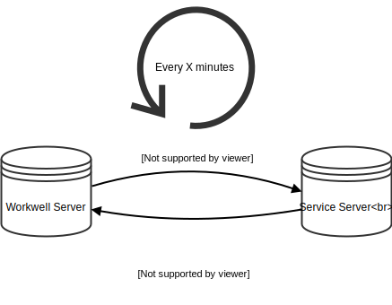

Service Authorization / Versioning
---

The service server needs to expose an endpoint called `/authorize` so that Workwell can call that route to verify if the service is down/live, its authenticity and a version number corresponding to the latest deployed version of the service.

The endpoint URL must have the same domain as the service domain itself.

Workwell will call the service server every X minutes to do the health/authenticity check and to update the service's version number (in the Workwell database) if it has changed.

When we then expose the service to the end-user, we add the version to the service's url like this :

https://www.workwell.io?v=A_VERSION_NUMBER

instead of :

https://www.workwell.io

This needs to be done to clean the cache of the previous service version.

You can use any methods you want to generate your version number and return it, as long as you update it when you have a new deployed version of your service.

For our own internal services, we use the SHA1 corresponding to our git repository's latest commit, which is a unique key.

