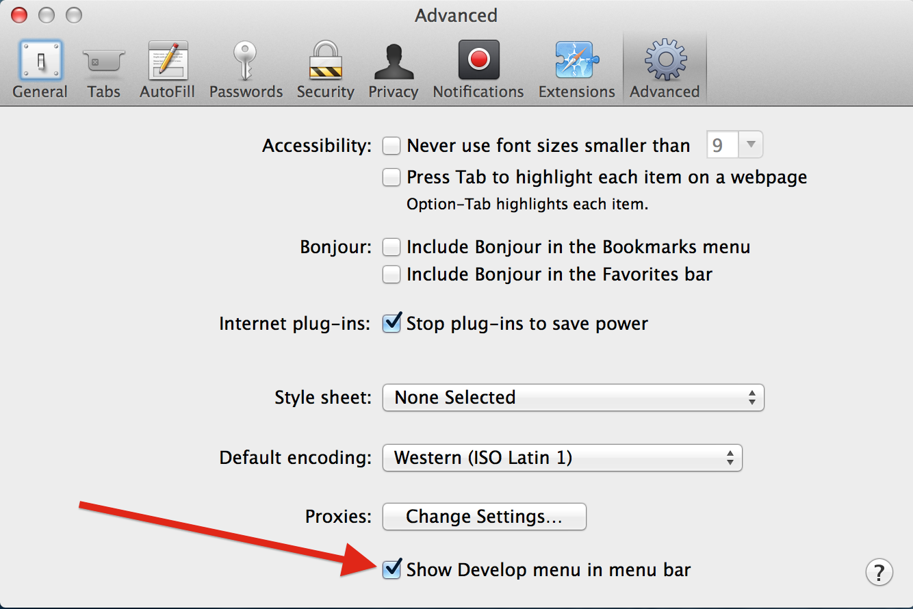
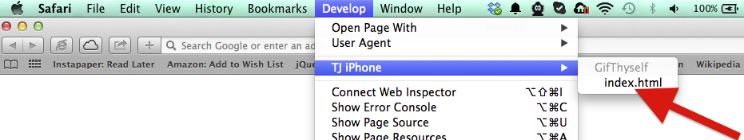
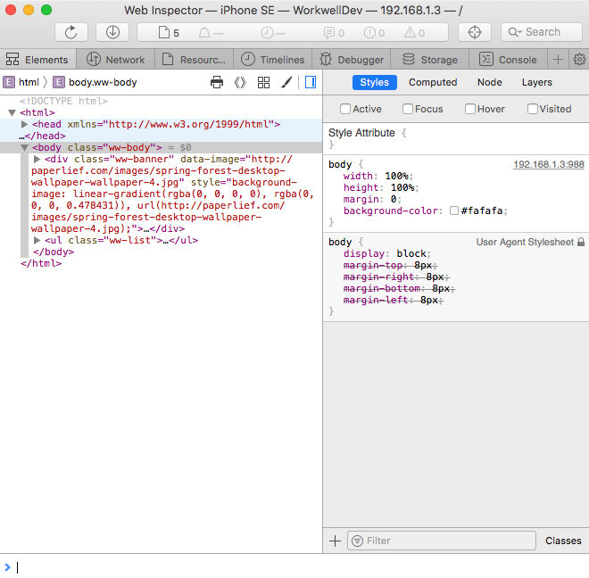
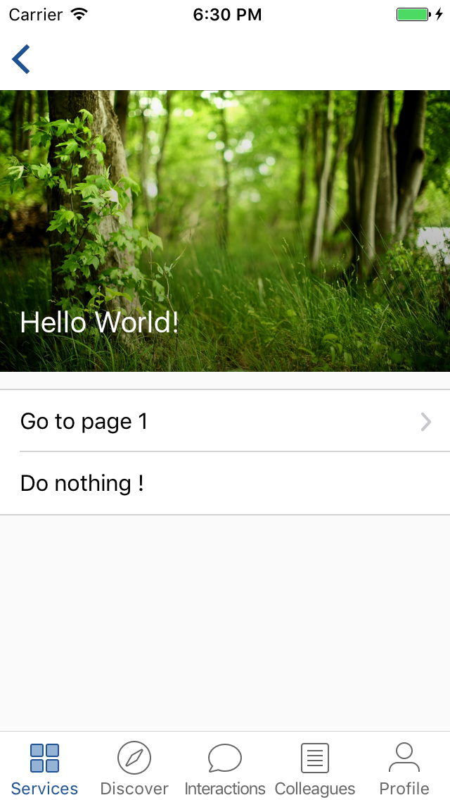

# Debugging

Debug WebViews in your native Android / iOS apps using Chrome / Safari Developer Tools. Your phone with the Workwell mobile app (test) running on, must be usb-plugged to your computer.

## iOS

Apple added the ability to remote debug iOS applications in iOS6. To use it there are a few prerequisites. First, go to the Settings app on your iOS device. There, navigate to <b>Safari –> Advanced</b>, and toggle on the <b>Web Inspector</b> switch.

In desktop Safari, go to the <b>Safari –> Preferences…</b> menu, select the <b>Advanced</b> tab, and ensure the <b>Show Develop menu in menu bar</b> check box is checked.

 

  <kbd></kbd>

 

When you open an iOS app that was built using a development provisioning profile, it is immediately available as an inspectable application in Safari’s <b>Develop</b> menu.

 

  <kbd></kbd>

 

At this point, you have the same <b>Safari Web Inspector</b> you use to debug Web applications on the desktop. You can select elements, tinker with CSS, debug JavaScript, profile your app, and more:

 

  <kbd></kbd>
  <kbd></kbd>

 

### Troubleshooting

Can't see your WebViews on the Safari’s <b>Develop</b> menu?

  - Verify that WebView debugging is enabled for your app.
  - Open the app with the WebView you want to debug, then restart Safari.

## Android

### Open a WebView in DevTools

The chrome://inspect page displays a list of debug-enabled WebViews on your device.

To start debugging, click inspect below the WebView you want to debug. Use DevTools as you would for a remote browser tab.

 

  <kbd></kbd>
  <kbd></kbd>

 

### Troubleshooting

Can't see your WebViews on the chrome://inspect page?

  - Verify that WebView debugging is enabled for your app.
  - On your device, open the app with the WebView you want to debug. Then, refresh the chrome://inspect page.
