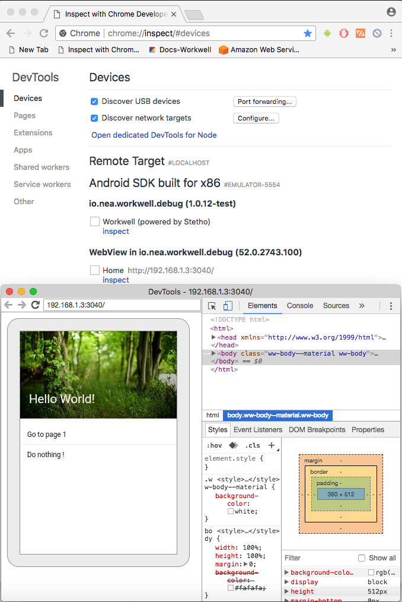
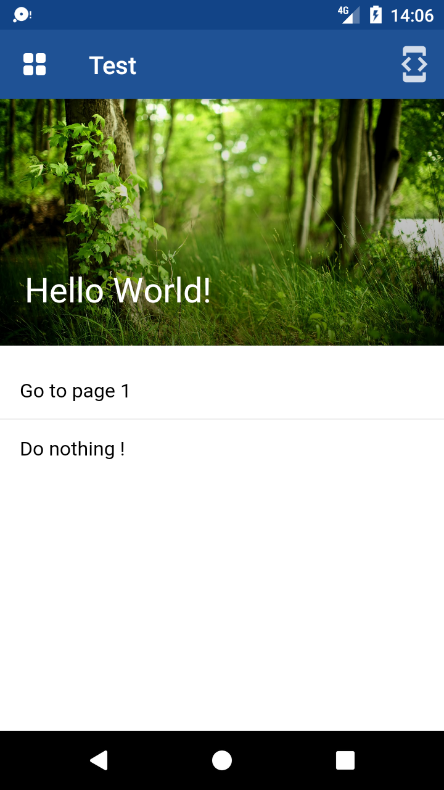

# Debugging

Debug WebViews in your native Android / iOS apps using Chrome / Safari Developer Tools. Your phone with the Workwell mobile app (test) running on, must be usb-plugged to your computer.

## iOS

To see the console's logs, simply click on the wheel button, on the top right corner.

## Android

### Open a WebView in DevTools

The chrome://inspect page displays a list of debug-enabled WebViews on your device.

To start debugging, click inspect below the WebView you want to debug. Use DevTools as you would for a remote browser tab.

 

  <kbd></kbd>
  <kbd></kbd>

 

### Troubleshooting

Can't see your WebViews on the chrome://inspect page?

  - Verify that WebView debugging is enabled for your app.
  - On your device, open the app with the WebView you want to debug. Then, refresh the chrome://inspect page.
