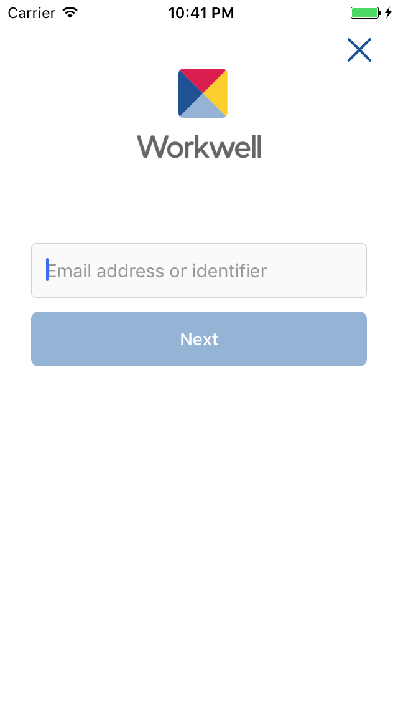
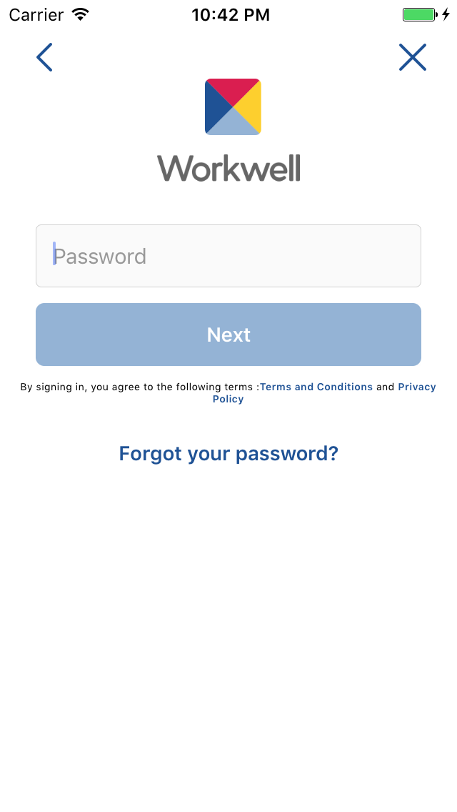
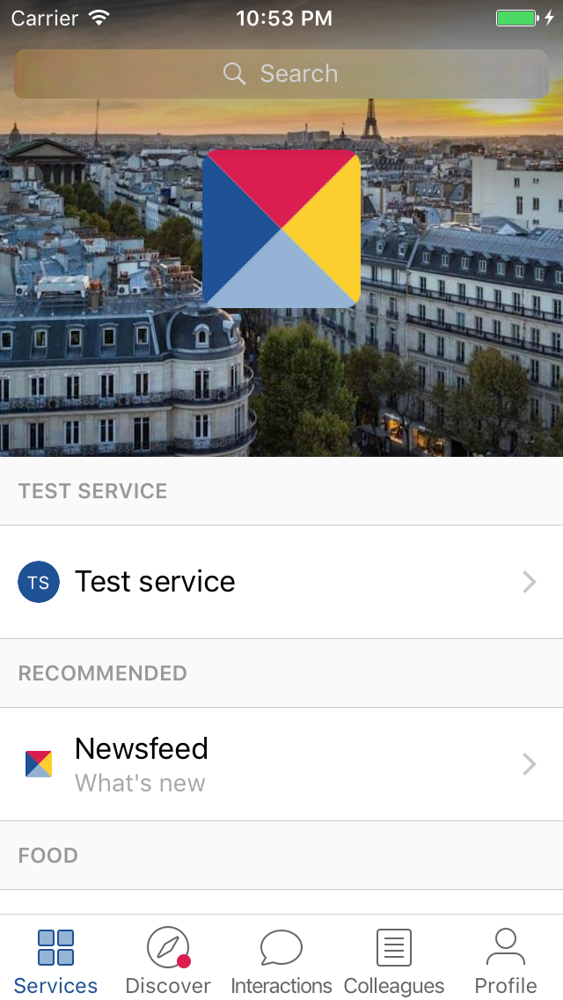
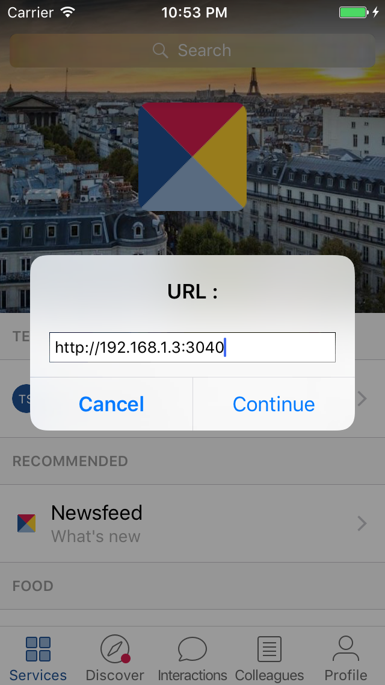
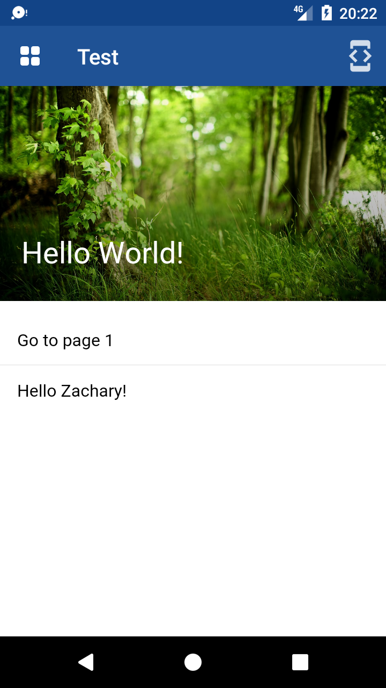
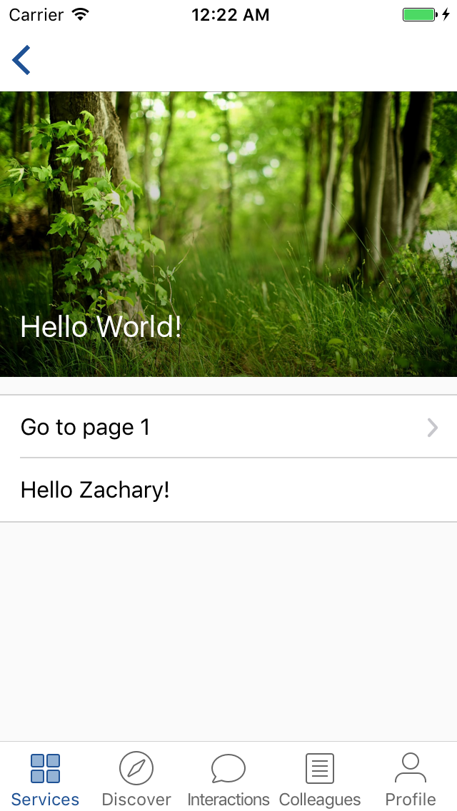

# Getting Started

## <a name="workwell-mobile-test"></a>1. Get the Workwell mobile test app

The Workwell mobile test application is available on HockeyApp. You should download it from the mobile you'll be using for development.

- [IOS](https://rink.hockeyapp.net/apps/3d57f8dcc1e849e583f2abb9c5a774da)

- [Android](https://rink.hockeyapp.net/apps/c1ff82f45af04051902b36cb4e3d8989)

The developer account to login into the app is the following (we are working to change that...)

- id: developers@workwell.io
- password: Workwell-123

<br/>
<p align="center">
<kbd></kbd>
<kbd></kbd>
</p>
<br/>

### Troubleshooting (iOS-only)

When you first open an enterprise app that you've manually installed, you see a notification that the developer of the app isn't trusted on your device. You can dismiss this message, but then you can't open the app.

After you dismiss this message, you can establish trust for the app developer. Tap <b>Settings</b> > <b>General</b> > <b>Profiles</b> or <b>Profiles & Device Management</b>. Under the "Enterprise App" heading, you see a profile for the developer.

Tap the name of the developer profile under the Enterprise App heading to establish trust for this developer.

Then you see a prompt to confirm your choice. After you trust this profile, you can manually install other apps from the same developer and open them immediately. This developer remains trusted until you use the Delete App button to remove all apps from the developer.

You must be connected to the Internet to verify the app developer's certificate when establishing trust. If you're behind a firewall, make sure that it's configured to allow connections to https://ppq.apple.com. If you aren't connected to the Internet when you trust an app, the device displays "Not Verified" instead. To use the app, connect to the Internet and tap the Verify App button.
  
## <a name="access-web-app"></a>2. Access your local (or online) web app

To access your local (or online) web app inside the Workwell application, simply click on the "Test" (Test Service for developers) item and a popup will then open, prompting you to type the URL that you want to open from inside Workwell. In the example below, I am trying to open my local web app that is running on the 3040 port.
  
  <br/>
  <p align="center">
  <kbd></kbd>
  <kbd></kbd>
  </p>
  <br/>

## <a name="service-secret-id"></a>3. Get a service-secret and a service-id

Please get in touch with Workwell tech support team to get a `service_id` and a `service_secret` once you register as a Workwell Service.

They will be used to obtain the `service token` that is necessary to initialize the SDK.

We recommend to store the `service_id` and `service_secret` in your back-end for security reason.

## <a name="service-token"></a>4. Get the `service token`

You will need to obtain a valid *service token* from Workwell API. This token will then be used when to initialize Workwell SDK.

To get the service token, a `service signature` needs to be generated which is a [HMAC_SHA256](https://en.wikipedia.org/wiki/HMAC) with key being your `service secret` and message being `{your service id}{current timestamp}`. The timestamp is the UNIX timestamp (in seconds and not milliseconds).

```
service_signature=HMAC_SHA256(service_secret, service_id + timestamp)
```

The service id, timestamp and signature will then be included in the headers `ww-service-id`, `ww-service-signature` and `ww-timestamp` in the request sent to Workwell API to obtain the service token:

```bash
curl -X GET "https://api.workwell.io/1.0/developer/service/token" \
    -H "accept: application/json" \
    -H "ww-service-id: {your_service_id}" \
    -H "ww-service-signature: {your_service_signature}" \
    -H "ww-timestamp: {current_timestamp}"
```

You can find in [Service token code examples](./service-token-examples.md) some code snippets on to retrieve the `service token` in different programming languages.

If all the headers are generated correctly, you will get the following data as return:

```json
{
  "service_name": "string",
  "service_token": "string",
}
```

Otherwise if any error happens, the API will return 400 with the following format

```json
{
  "context": "string",
  "error_code": 0,
  "message": "string"
}
```

Here are the possible values for `error_code`:

* if `error_code = 5`: Missing header. The ww-service-id, ww-service-signature and ww-timestamp headers are mandatory

* if `error_code = 2`: The ww-timestamp is too old. It should be at max in the last hour.

* if `error_code = 9`: The service id is unknown. Please keep contact workwell developer team to have a valid service id.

* if `error_code = 8`: The service signaure is invalid. Please consult the workwell docs on how to generate valid signature.

* if `error_code = 10`: The data type is invalid. Often happens when the ww-timestamp is not an integer.

## <a name="build-first"></a>5. Build your first Workwell web app

A complete example can be found at https://github.com/Workwell/service_template

This tutorial walks you through creating your first Workwell web App. The guide assumes intermediate level knowledge of HTML, CSS, and JavaScript. If you are totally new to frontend development, it might not be the best idea to jump right into a framework as your first step - grasp the basics then come back! Prior experience with other frameworks helps, but is not required.

For the purpose of this tutorial, we will consider that you already have a basic web app structure (full JS, back-end and front-end, but can easily be translated to other languages like Python or PHP).

Let's also assume you have a project structure that looks like this:

 * dist
   * index.bundle.js
   * page1.bundle.js
 * js
   * index.js
   * page1.js
 * layouts
   * index.html
   * page1.html
 * package.json
 * server.js
 * webpack.config.js


### Step 1: 

Install Workwell JS:

`npm install workwell --save-dev`

### Step 2:

Import it in your index.js and page1.js files:

```javascript
const Workwell = require("workwell");

// Do a bunch of stuff
```

### Step 3:

Implement the service token generation method in your `server.js` file:

```javascript
// server.js
// Do whatever you need to have your server working, here we are using the 'express' package
const express = require('express');
const app = express();

// ...
// server code
// ...

const serviceId = YOUR_SERVICE_ID;
const serviceSecret = YOUR_SERVICE_SECRET;
const ERROR_SERVICE_SECRET_NOT_VALID = 8;
const ERROR_SERVICE_ID_NOT_VALID = 9;

app.get('/service_token', function (req, response) {
    // the time needs to be in seconds
    var now = parseInt(new Date().getTime() / 1000);
    const signature = crypto.createHmac('sha256', serviceSecret).update(serviceId + String(now)).digest('base64');

    request({
        uri: 'https://api.workwell.io/1.0/developer/service/token',
        method: 'GET',
        headers: {
            'ww-service-signature': signature,
            'ww-timestamp': '' + now,
            'ww-service-id': serviceId
        }
    }, function (error, res, body) {
        var result = JSON.parse(body);
        if (result.error_code === ERROR_SERVICE_SECRET_NOT_VALID) {
            console.log("error : your service_secret '" + serviceSecret + "' is not valid");
        } else if (result.error_code === ERROR_SERVICE_ID_NOT_VALID) {
            console.log("error : your service_id '" + serviceId + "' is not valid");
        }
        response.send(result);
    });
});

// ...
// server code
// ...
```

### Step 4:

Get a service token as the first thing you do in the front-end and insert it in the Workwell object:

```javascript
// index.js
const Workwell = require("workwell");

function getServiceToken() {
    return new Promise((resolve, reject) => {
        let request = new XMLHttpRequest();
        request.open('GET', './service_token', true);

        request.onload = () => {
            if (request.status >= 200 && request.status < 400) {
                let res = JSON.parse(request.responseText);
		// store the serviceToken in localStorage so we can use it again in other pages
		// the serviceToken expiration is 1h so you don't need to get a new one everytime.
                window.localStorage.serviceToken = res.service_token; 
                
        	// Init the Workwell SDK
        	Workwell.setServiceToken(res.service_token);
		
                resolve(res);
            } else {
                reject(request);
            }
        };

        request.onerror = function () {
            reject(request);
        };

        request.send();
    });
}

Workwell.ui.ready(function(){
	getServiceToken()
		.then(function(res){
		   // getUserAccessToken, see next step
		})
		.catch(function(error){
		   console.log(error);
		});
});
```

### Step 5:

You are now allowed to use any bridging methods of the SDK (and in a securey way). Let's use the `getUserInfo` (cf. [getUserInfo](js-sdk.md#getuserinfo)) method for instance. 

This methods returns an `access_token` that allows you to fetch the user's information from the Workwell API and then you will have the possibility to <b>automatically log the user</b> to his personal account (for your service) or to <b>create a new one</b>, if non-existent:

```javascript
// index.js 

// ...
// ...

function getUserAccessToken() {
    return new Promise((resolve, reject) => {
    	// Here we can now use this method (since we inserted the valid service-token just before
        Workwell.getUserInfo({
            success: (res) => {
                console.log("success get user info", res);	
		// Here you have the access_token in 'res.access_token'
                resolve(res);
            },
            error: (data) => {
                console.log("error get user info");
                reject(data);
            }
        });
    });
}

Workwell.ui.ready(function(){
	getServiceToken()
		.then(getUserAccessToken)
		.catch(function(error){
		   console.log(error);
		});
});
```

### Step 6:

Let's now retrieve the user's information by calling the Workwell API endpoint [user_info](api.md#user-info) from our back-end:

```javascript
// server.js
// ...

app.get('/user_info:access_token', function (req, response) {
    var accessToken = req.params.access_token;
    
    // the time needs to be in seconds
    var now = parseInt(new Date().getTime() / 1000);
    const signature = crypto.createHmac('sha256', serviceSecret).update(serviceId + String(now)).digest('base64');

    request({
        uri: 'https://api.workwell.io/1.0/developer/service/token',
        method: 'GET',
        headers: {
            'ww-service-signature': signature,
            'ww-timestamp': '' + now,
            'ww-service-id': serviceId,
	    'ww-access-token': accessToken
        }
    }, function (error, res, body) {
        var result = JSON.parse(body);
        if (result.error_code === ERROR_SERVICE_SECRET_NOT_VALID) {
            console.log("error : your service_secret '" + serviceSecret + "' is not valid");
        } else if (result.error_code === ERROR_SERVICE_ID_NOT_VALID) {
            console.log("error : your service_id '" + serviceId + "' is not valid");
        }
        response.send(result);
    });
});

// ...
```

```javascript
// index.js 

// ...
// ...

function getUserInfo(data) {
    return new Promise((resolve, reject) => {
        let request = new XMLHttpRequest();
        request.open('GET', './user_info/' + data.access_token, true);

        request.onload = () => {
            if (request.status >= 200 && request.status < 400) {
                let res = JSON.parse(request.responseText);
                resolve(res);
            } else {
                reject(request);
            }
        };

        request.onerror = function () {
            reject(request);
        };

        request.send();
    });
}

Workwell.ui.ready(function(){
	getServiceToken()
		.then(getUserAccessToken)
		.then(getUserInfo)
		.catch(function(error){
		   console.log(error);
		});
});
```

### Step 7:

Let's add some UI to it! We'll just be adding a <b>banner component</b> and a <b>list component</b> containing two items (one with the user's first name, the other one to open page1). Here is the complete code:

```javascript
// index.js
const Workwell = require("workwell");

function getServiceToken() {
    return new Promise((resolve, reject) => {
        let request = new XMLHttpRequest();
        request.open('GET', './service_token', true);

        request.onload = () => {
            if (request.status >= 200 && request.status < 400) {
                window.localStorage.serviceToken = request.responseText; // so that we can use it again in other page
                Workwell.setServiceToken(request.responseText);
                resolve(request.responseText);
            } else {
                reject(request);
            }
        };

        request.onerror = function () {
            reject(request);
        };

        request.send();
    });
}

function getUserAccessToken() {
    return new Promise((resolve, reject) => {
        Workwell.getUserInfo({
            success: (res) => {
                console.log("success get user info");
                resolve(res);
            },
            error: (data) => {
                console.log("error get user info");
                reject(data);
            }
        });
    });
}

function getUserInfo(data) {
    return new Promise((resolve, reject) => {
        let request = new XMLHttpRequest();
        request.open('GET', './user_info/' + data.access_token, true);

        request.onload = () => {
            if (request.status >= 200 && request.status < 400) {
                let res = JSON.parse(request.responseText);
                resolve(res);
            } else {
                reject(request);
            }
        };

        request.onerror = function () {
            reject(request);
        };

        request.send();
    });
}

function renderUI(user) {
    document.body.appendChild(
        Workwell.ui.createBanner()
            .setBackgroundImage("http://paperlief.com/images/spring-forest-desktop-wallpaper-wallpaper-4.jpg")
            .add(
                Workwell.ui.createBannerTitle()
                    .setValue("Hello World!")
            )
            .toHTMLElement()
    );

    document.body.appendChild(
        Workwell.ui.createList()
            .add(
                Workwell.ui.createListItem()
                    .setTappable(true)
                    .addToCenter(
                        Workwell.ui.createListItemTitle()
                            .setValue("Go to page 1")
                    )
                    .addToRight(
                        Workwell.ui.createListItemChevronIcon()
                    )
                    .onClick(function () {
                        Workwell.openWebPage(window.location.href + "/page1");
                    })
            )
            .add(
                Workwell.ui.createListItem()
                    .setTappable(true)
                    .addToCenter(
                        Workwell.ui.createListItemTitle()
                            .setValue("Hello " + user.first_name + "!")
                    )
            )
            .toHTMLElement()
    )
}

Workwell.ui.ready(function () {
	getServiceToken()
		.then(getUserAccessToken)
		.then(getUserInfo)
		.then(renderUI)
		.catch(function (error) {
			console.log(error);
		});
});
```

Here is what it looks like in Android and iOS:

<br>
<p align="center">
  <kbd></kbd>
  <kbd></kbd>
</p>
<br>
