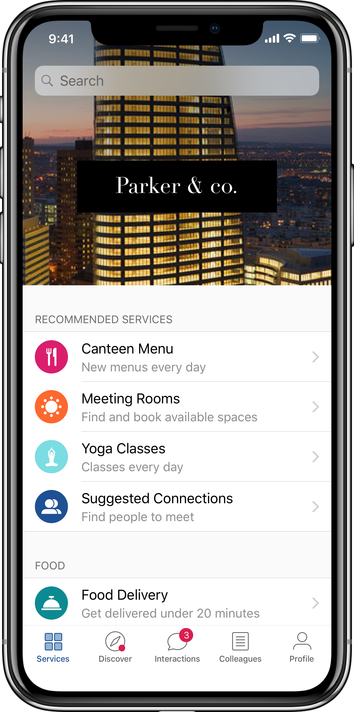
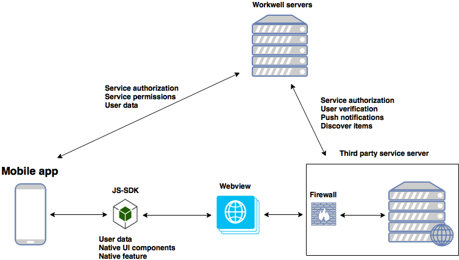
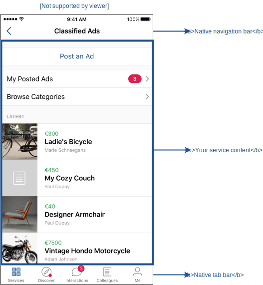

# Getting Started

Put your service between the hands of thousands of employees by doing a Workwell integration. Wether you already have a web service or you’re building one from scratch, Workwell provides the necessary tools to make the integration easy and fast.

## Technical concept

Before your start diving into the technical details, we wanted to let you know about our general technical concept. Workwell is a native mobile application. Services are web apps, presented to the user on a dedicated screen. Opening a service is done by loading its URL in a in-app custom webview. Using the Workwell JS-SDK, your service can communicate with the Workwell native application.

Here are the different components inside a service:

## Workwell SDK

Workwell SDK allows you:

* To get data about the user.
* To use native features (e.g. Camera, Chat etc.).
* To use native like UI components that handle the differences between OS and Android for you.
* To use native UI components to give the user experience a more native flavour (e.g. date/time pickers, toast messages etc.).

## Integration requirements

We have put in place a number of requirements for a Workwell integration to ensure the best user experience with a strong attention to the security aspects of our technical model:

* Automatic user identification: By using Workwell, users can access all the services provided by their companies, they shouldn’t need to manually login in or create accounts when opening your service. Use the JS-SDK to get the user’s informations so you can, behind the hood, automatically create an account or log the user in. **User should never therefore have to login to use your service**.

* Mobile friendly: We require your service to be mobile friendly and to respect Workwell UI guidelines. We strongly recommend you to use the JS-SDK UI features!

* Expose a health check endpoint: Your server needs to expose an endpoint Workwell servers can call to verify your service health and its authenticity, c.f. [Service Authorization/Versioning](./service-authorization-versioning.md)

*We also recommend using classic navigation with `<a href="...">` and not SPA (single page application) router. A native app opens a new view/page when navigating from one content to another, cf [Open Web Page](../open-web-page.md) for more information*
