# UI Components

Here is the list of all the UI components (and their methods) available in the SDK.

## Banner

### add

This function adds an element to the <b>Banner</b> Component, it can only be a <b>BannerTitle</b> or a <b>BannerSubtitle</b>.

**Parameters**
     
- `el` **[Object](https://developer.mozilla.org/en-US/docs/Web/JavaScript/Reference/Global_Objects/Object)** a Javascript Object (preferably a BannerTitle or BannerSubtitle Object)

### setBackgroundImage

This function sets the background image of the <b>Banner</b> Component.

**Parameters**
     
- `src` **[string](https://developer.mozilla.org/en-US/docs/Web/JavaScript/Reference/Global_Objects/String)** a string referencing the url where your background-image is

**Example**

```javascript
document.body.appendChild(
      Workwell.ui.createBanner()
          .setBackgroundImage("http://informationcommunicationtechnology.com/wp-content/uploads/2018/06/Forest-Wallpaper.jpg")
          .add(Workwell.ui.createBannerTitle("Banner Title"))
          .add(Workwell.ui.createBannerSubtitle("Banner Subtitle"))
          .toHTMLElement()
);
```

<br/>
  <p align="center">
  <kbd></kbd>
  <kbd>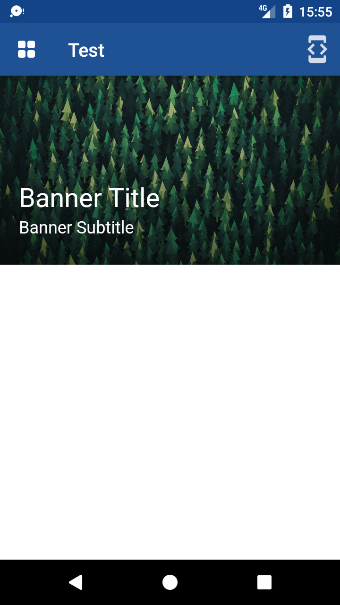</kbd>
  </p>
  <br/>

## BannerSubtitle

### getValue

This function returns the value of the subtitle.

### setValue

This function sets the value of the subtitle.

**Parameters**
     
- `value` **[string](https://developer.mozilla.org/en-US/docs/Web/JavaScript/Reference/Global_Objects/String)** the value of the subtitle

**Example**

```javascript
document.body.appendChild(
      Workwell.ui.createBanner()
          .setBackgroundImage("http://informationcommunicationtechnology.com/wp-content/uploads/2018/06/Forest-Wallpaper.jpg")
          .add(Workwell.ui.createBannerSubtitle.setValue("Banner Subitle"))
          .toHTMLElement()
);
```

## BannerTitle

### getValue

This function returns the value of the title.

### setValue

This function sets the value of the title.

**Parameters**
     
- `value` **[string](https://developer.mozilla.org/en-US/docs/Web/JavaScript/Reference/Global_Objects/String)** the value of the title

**Example**

```javascript
document.body.appendChild(
      Workwell.ui.createBanner()
          .setBackgroundImage("http://informationcommunicationtechnology.com/wp-content/uploads/2018/06/Forest-Wallpaper.jpg")
          .add(Workwell.ui.createBannerTitle.setValue("Banner Title"))
          .toHTMLElement()
);
```

## Button

### disable

This function disables the button.

### enable

This function enables the button.

### getText

This function returns the text value of the button.

### onClick

This function sets the function that will be called once a click is performed on the button.

**Parameters**
     
- `fn` **[function](https://developer.mozilla.org/en-US/docs/Web/JavaScript/Reference/Functions)** the function to call

### setText

This function sets the value of the text contained in the button.

- `value` **[string](https://developer.mozilla.org/en-US/docs/Web/JavaScript/Reference/Global_Objects/String)** the value of the text

### setType

This function sets the type of the button.

- `type` **[string](https://developer.mozilla.org/en-US/docs/Web/JavaScript/Reference/Global_Objects/String)** the type of the button

**Example**

```javascript
document.body.appendChild(
      Workwell.ui.createButton("I'm a button!")
          .onClick(function(){
              // do whatever
          })
          .toHTMLElement()
);
```

<br/>
  <p align="center">
  <kbd>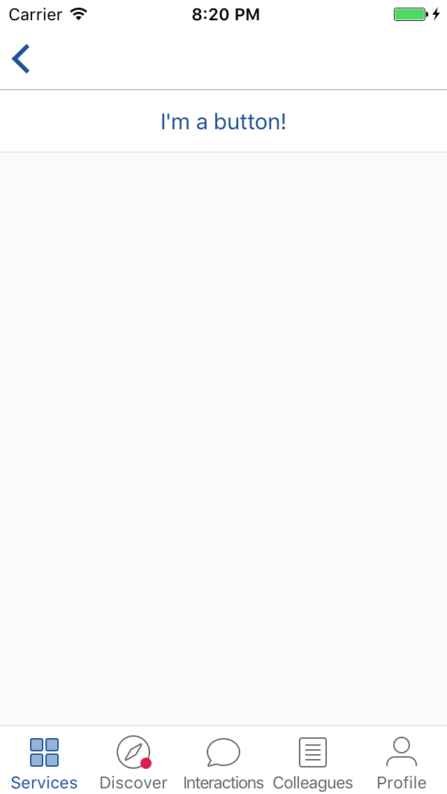</kbd>
  <kbd>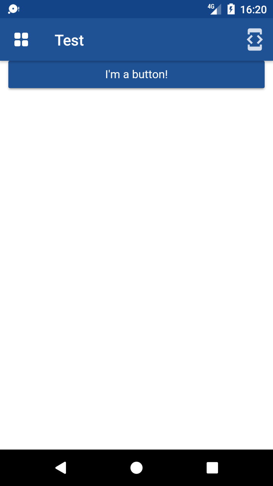</kbd>
  </p>
  <br/>

## Icon

### setType

This function sets the type of the icon.

- `type` **[string](https://developer.mozilla.org/en-US/docs/Web/JavaScript/Reference/Global_Objects/String)** the type of the icon (can be 'chevron'|'directions'|'check')

**Example**

```javascript
document.body.appendChild(
      Workwell.ui.createIcon().setType("check").toHTMLElement()
);
```

<br/>
  <p align="center">
  <kbd>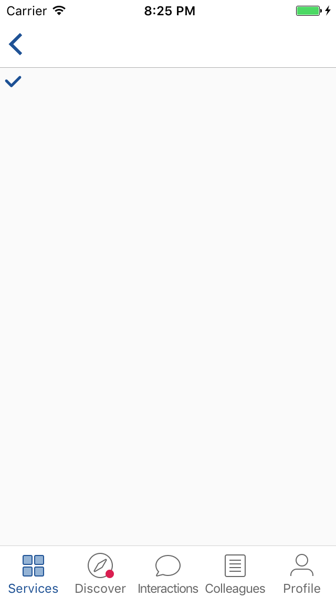</kbd>
  <kbd>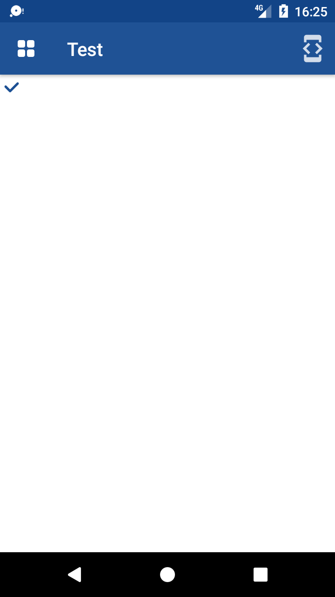</kbd>
  </p>
  <br/>

## Input

### disable

This function disables the input.

### enable

This function enables the input.

### getMaxLength

This function returns the input's maximum length.

### getPlaceholder

This function returns the input's placeholder' value.

### getValue

This function returns the input's value.

### onClick

This function sets the function that will be called once a click is performed on the input.

**Parameters**
     
- `fn` **[function](https://developer.mozilla.org/en-US/docs/Web/JavaScript/Reference/Functions)** the function to call

### onInput

This function sets the function that will be called every time there is a change in the input.

**Parameters**
     
- `fn` **[function](https://developer.mozilla.org/en-US/docs/Web/JavaScript/Reference/Functions)** the function to call

### setAssistiveText

This function sets the value of the input's assistive text (Android-only, will do nothing on iOS).

- `value` **[string](https://developer.mozilla.org/en-US/docs/Web/JavaScript/Reference/Global_Objects/String)** the value of the assistive text

### setHeader

This function adds a header to the input, the same header-like as the list can have (iOS-only). For Android, it will also work as the setPlaceholder method.

- `text` **[string](https://developer.mozilla.org/en-US/docs/Web/JavaScript/Reference/Global_Objects/String)** the value of the header

### setMaxLength

This function sets the input's maximum length.

- `maxLength` **[number](https://developer.mozilla.org/en-US/docs/Web/JavaScript/Reference/Global_Objects/Number)** the maximum length of the input

### setRequired

This function makes the input required or not (this will add an assistive-text on Android Inputs and only an asterisk on iOS Inputs).

- `required` **[boolean](https://developer.mozilla.org/en-US/docs/Web/JavaScript/Reference/Global_Objects/Boolean)** the boolean to set the requirement of the input

### setPlaceholder

This function sets the value of the input's placeholder.

- `value` **[string](https://developer.mozilla.org/en-US/docs/Web/JavaScript/Reference/Global_Objects/String)** the value of the placeholder

### setType

This function sets the type of the input.

- `type` **[string](https://developer.mozilla.org/en-US/docs/Web/JavaScript/Reference/Global_Objects/String)** the type of the input (can be 'text'(default)|'number')

### setValue

This function sets the value of the input.

- `value` **[string](https://developer.mozilla.org/en-US/docs/Web/JavaScript/Reference/Global_Objects/String)** the value of the input

**Example**

```javascript
document.body.appendChild(
    Workwell.ui.createInput()
        .setPlaceholder("I'm a placeholder")
        .setMaxLength(48)
        .setAssistiveText("<span style='color:red'>I'm an input</span>")
        .onInput(function(){
            console.log("input's value has changed");
        })
        .toHTMLElement()
);
```

<br/>
  <p align="center">
  <kbd>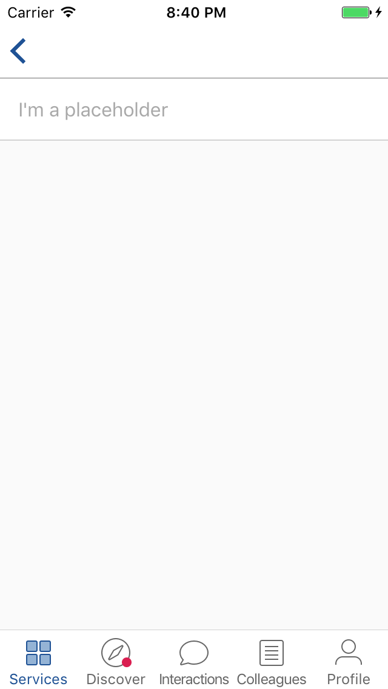</kbd>
  <kbd>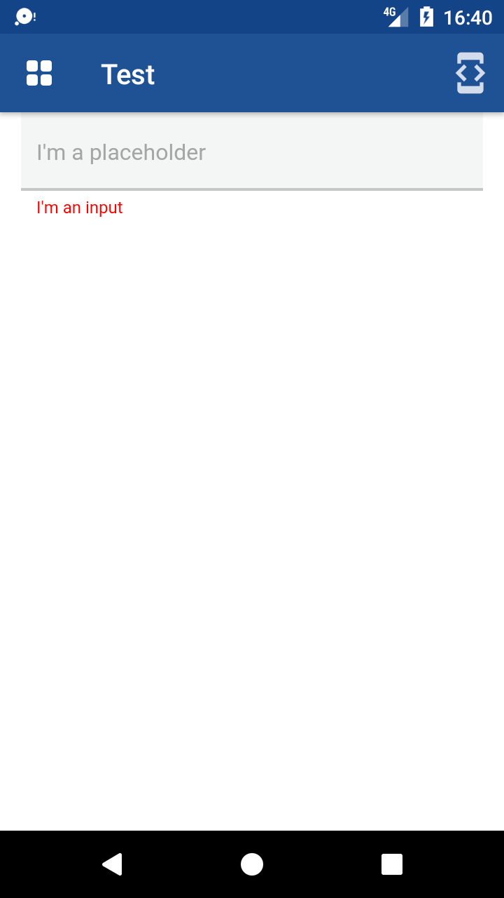</kbd>
  </p>
  <br/>

## List

### add

This function adds an element to the list, preferably a <b>ListItem</b>.

- `el` **[Object](https://developer.mozilla.org/en-US/docs/Web/JavaScript/Reference/Global_Objects/Object)** a Javascript Object (preferably a ListItem Object)

### removeItemWithId

This function removes the <b>ListItem</b> from the list, with a particular id.

- `id` **[string](https://developer.mozilla.org/en-US/docs/Web/JavaScript/Reference/Global_Objects/String)** the id of the element to remove

### setAssistiveText

This function is iOS-only. It will add an assistive-text at the end of the list (especially used for forms with required fields, you can add an assistive-text saying "*Required" below the List Component).

- `value` **[string](https://developer.mozilla.org/en-US/docs/Web/JavaScript/Reference/Global_Objects/String)** the value of the assistive text

### setHeader

This function sets the header of the list with a particular value in it (given in argument).

- `value` **[string](https://developer.mozilla.org/en-US/docs/Web/JavaScript/Reference/Global_Objects/String)** the value of the header

**Example**

```javascript
document.body.appendChild(
    Workwell.ui.createList()
        .setHeader("Header")
        .toHTMLElement()
);
```

## ListItem

Ths <b>ListItem</b> is composed with three parts (left, center and right) and any number of elements can be added to those different parts as long as the mobile UI/UX is respected. 

### addToCenter

This function adds an element to the center of the <b>ListItem</b>.

- `el` **[Object](https://developer.mozilla.org/en-US/docs/Web/JavaScript/Reference/Global_Objects/Object)** a Javascript Object

### addToLeft

This function adds an element to the left of the <b>ListItem</b>.

- `el` **[Object](https://developer.mozilla.org/en-US/docs/Web/JavaScript/Reference/Global_Objects/Object)** a Javascript Object

### addToRight

This function adds an element to the right of the <b>ListItem</b>.

- `el` **[Object](https://developer.mozilla.org/en-US/docs/Web/JavaScript/Reference/Global_Objects/Object)** a Javascript Object

### hide

This function hides the item.

### onClick

This function sets the function that will be called once a click is performed on the <b>ListItem</b>.

**Parameters**
     
- `fn` **[function](https://developer.mozilla.org/en-US/docs/Web/JavaScript/Reference/Functions)** the function to call

### setTappable

This function can make a <b>ListItem</b> tappable or not (by default, it is not). That means that the native shadowy-effect is active or not (when tapping the <b>ListItem</b>).

**Parameters**
     
- `tappable` **[boolean](https://developer.mozilla.org/en-US/docs/Web/JavaScript/Reference/Global_Objects/Boolean)** the boolean to set the tappability of the item

### show

This function shows the item (if it was hidden).

**Example**

```javascript
document.body.appendChild(
    Workwell.ui.createList()
        .setHeader("header")
        .add(
            Workwell.ui.createListItem()
                .setTappable(true)
                .addToCenter(
                    Workwell.ui.createListItemTitle("List Item Title")
                )
                .addToRight(
                    Workwell.ui.createIcon().setType("check")
                )
        )
        .add(
            Workwell.ui.createListItem()
                .addToCenter(
                    Workwell.ui.createListItemSubtitle("List Item Subtitle")
                )
                .addToRight(
                    Workwell.ui.createIcon().setType("check")
                )
        )
        .add(
            Workwell.ui.createListItem()
                .addToCenter(
                    Workwell.ui.createListItemTitle("List Item Title")
                )
                .addToRight(
                    Workwell.ui.createListItemLabel("Label")
                )
        )
        .toHTMLElement()
);
```

<br/>
  <p align="center">
  <kbd>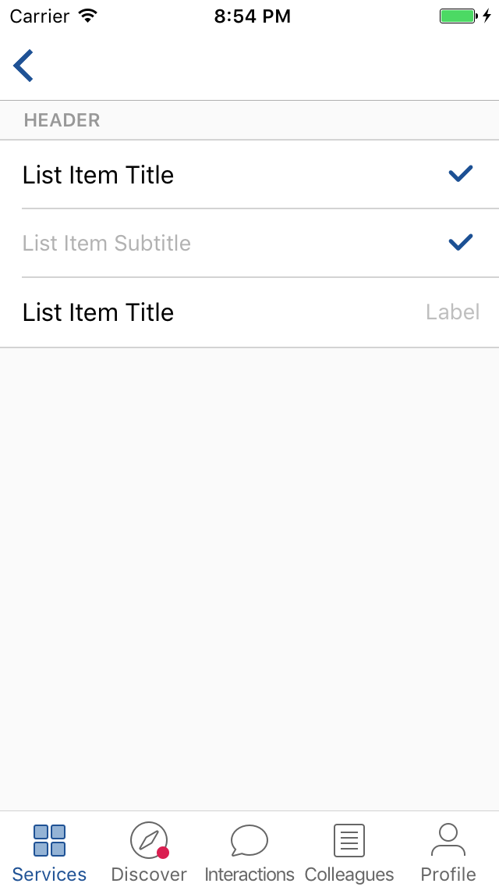</kbd>
  <kbd>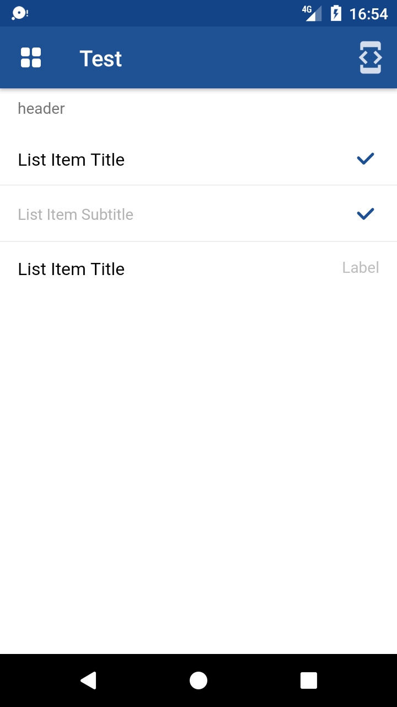</kbd>
  </p>
  <br/>

## ListItemChevronIcon

This element is actually here because in a <b>ListItem</b> element, you can't have the chevron icon on the right (for Android). So using this method insures that for iOS you will have the chevron icon in your <b>ListItem</b> and nothing for Android.

**Example**

```javascript
document.body.appendChild(
  Workwell.ui.createList()
        .add(
            Workwell.ui.createListItem()
                .addToCenter(
                    Workwell.ui.createListItemTitle("List Item Title")
                )
                .addToRight(
                    Workwell.ui.createListItemChevronIcon()
                )
        )
        .toHTMLElement()
);
```

<br/>
  <p align="center">
  <kbd>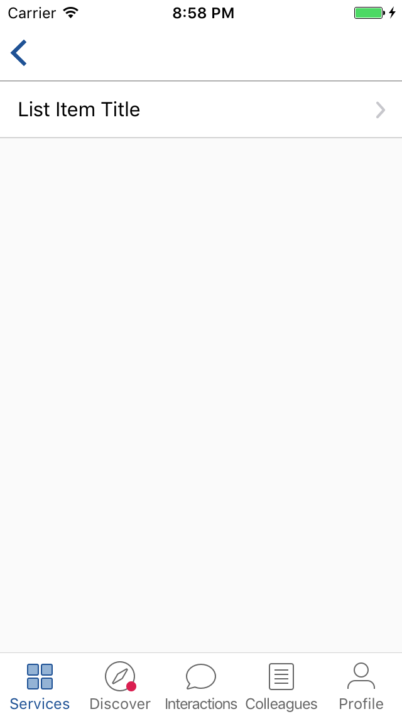</kbd>
  <kbd></kbd>
  </p>
  <br/>

## ListItemLabel

### getValue

This function returns the value of the label.

### setValue

This function sets the value of the label.

**Parameters**
     
- `value` **[string](https://developer.mozilla.org/en-US/docs/Web/JavaScript/Reference/Global_Objects/String)** the value of the label

## ListItemSubtitle

### getValue

This function returns the value of the subtitle.

### setValue

This function sets the value of the subtitle.

**Parameters**
     
- `value` **[string](https://developer.mozilla.org/en-US/docs/Web/JavaScript/Reference/Global_Objects/String)** the value of the subtitle

## ListItemTitle

### getValue

This function returns the value of the title.

### setValue

This function sets the value of the title.

**Parameters**
     
- `value` **[string](https://developer.mozilla.org/en-US/docs/Web/JavaScript/Reference/Global_Objects/String)** the value of the title

## PagingIndicator

### getPageCount

This function returns the number of dots (pages) that are in the <b>PagingIndicator</b> Component.

### getSelectedPage

This function returns the selected dot (page) in the <b>PagingIndicator</b> Component.

### setPageCount

This function sets the number of dots (pages) that are in the <b>PagingIndicator</b> Component.

- `pageCount` **[number](https://developer.mozilla.org/en-US/docs/Web/JavaScript/Reference/Global_Objects/Number)** the number of dots (pages) in the component

### setSelectedPage

This function sets the selected dot (page) in the <b>PagingIndicator</b> Component.

- `selectedPage` **[number](https://developer.mozilla.org/en-US/docs/Web/JavaScript/Reference/Global_Objects/Number)** the index of the selected page in the component

**Example**

```javascript
document.body.appendChild(
    Workwell.ui.createPagingIndicator()
        .setPageCount(7)
        .setSelectedPage(3)
        .toHTMLElement()
);
```

<br/>
  <p align="center">
  <kbd>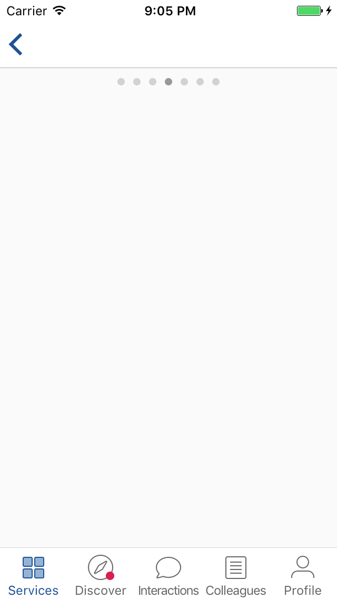</kbd>
  <kbd>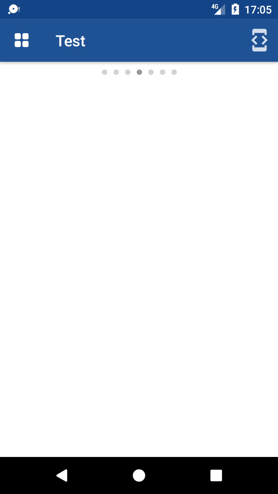</kbd>
  </p>
  <br/>
  
## Picker

### disable

This function disables the textarea.

### enable

This function enables the textarea.

### getLabel

This function returns the label associated to the picker.

### getSelectedIndex

This function returns the index associated to the selected value in the picker.

### getSelectedValue

This function returns the value associated to the picker.

### onClick

This function sets the function that will be called once a click is performed on the picker.

**Parameters**
     
- `fn` **[function](https://developer.mozilla.org/en-US/docs/Web/JavaScript/Reference/Functions)** the function to call

### setAssistiveText

This function sets the value of the picker's assistive text (Android-only, will do nothing on iOS).

- `value` **[string](https://developer.mozilla.org/en-US/docs/Web/JavaScript/Reference/Global_Objects/String)** the value of the assistive text

### setLabel

This function sets the value of the picker's label (Android-only).

- `label` **[string](https://developer.mozilla.org/en-US/docs/Web/JavaScript/Reference/Global_Objects/String)** the value of the label

### setOptions

This function sets the options within the picker.

- `options` **[array](https://developer.mozilla.org/en-US/docs/Web/JavaScript/Reference/Global_Objects/Array)** the value of the options, as an array

### setRequired

This function makes the picker required or not (this will add an assistive-text on Android picker).

- `required` **[boolean](https://developer.mozilla.org/en-US/docs/Web/JavaScript/Reference/Global_Objects/Boolean)** the boolean to set the requirement of the picker

### setSelectedIndex

This function sets the index of the selected index within the picker.

- `index` **[number](https://developer.mozilla.org/en-US/docs/Web/JavaScript/Reference/Global_Objects/Number)** the value of the index

### setSelectedValue

This function sets the value selected within the picker.

- `value` **[string](https://developer.mozilla.org/en-US/docs/Web/JavaScript/Reference/Global_Objects/String)** the value of the picker

**Example**

```javascript
document.body.appendChild(
    Workwell.ui.createList()
       .add(
           Workwell.ui.createListItem()
               .addToCenter(
                   Workwell.ui.createInput()
                       .setRequired(true)
                       .setPlaceholder("Input")
               )
               .addToRight(
                   Workwell.ui.createPicker()
                       .setRequired(true)
                       .setLabel("Picker")
                       .setOptions(["iOS", "Android", "Windows"])
               )
       )
       .toHTMLElement()
);
```

<br/>
  <p align="center">
  <kbd>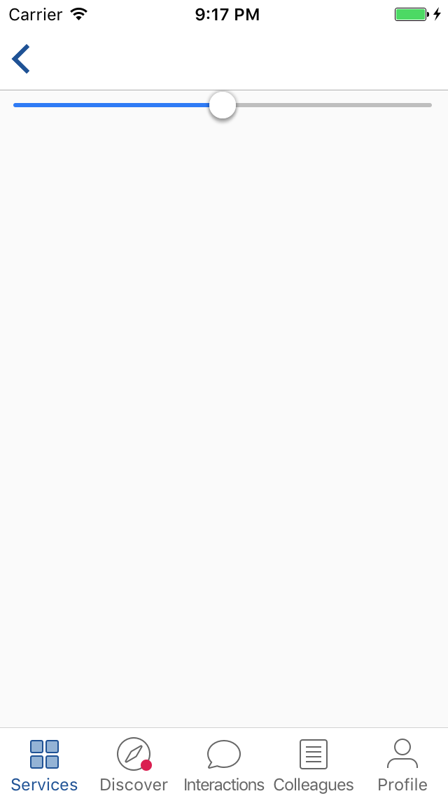</kbd>
  <kbd>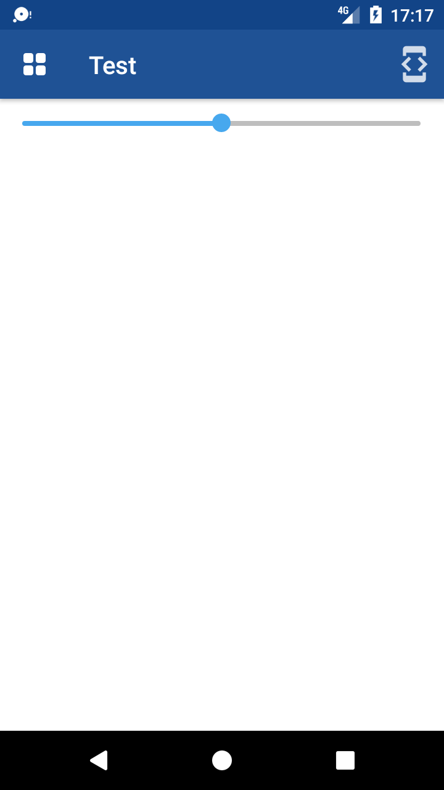</kbd>
  <kbd></kbd>
  <kbd></kbd>
  </p>
<br/>

## Slider

### getCurrentValue

This function returns the current value of the slider.

### onDrag

This function sets the function that will be called every time there is a drag of the slider.

**Parameters**
     
- `fn` **[function](https://developer.mozilla.org/en-US/docs/Web/JavaScript/Reference/Functions)** the function to call

### onRelease

This function sets the function that will be called once the slider's handle is released.

**Parameters**
     
- `fn` **[function](https://developer.mozilla.org/en-US/docs/Web/JavaScript/Reference/Functions)** the function to call

### setCurrentValue

This function sets the current value of the slider.

- `currentValue` **[number](https://developer.mozilla.org/en-US/docs/Web/JavaScript/Reference/Global_Objects/Number)** the value of the slider

### setMax

This function sets the maximum value of the slider.

- `max` **[number](https://developer.mozilla.org/en-US/docs/Web/JavaScript/Reference/Global_Objects/Number)** the maximum value of the slider

### setMin

This function sets the minimum value of the slider.

- `min` **[number](https://developer.mozilla.org/en-US/docs/Web/JavaScript/Reference/Global_Objects/Number)** the maximum value of the slider

### setStep

This function sets the step (interval between each points) of the slider.

- `step` **[number](https://developer.mozilla.org/en-US/docs/Web/JavaScript/Reference/Global_Objects/Number)** the step of the slider

**Example**

```javascript
document.body.appendChild(
    Workwell.ui.createSlider()
        .setStep(1.5)
        .setMin(0)
        .setMax(100)
        .setCurrentValue(50)
        .onDrag(function(val){
            // val contains the new current value
            console.log(val);
        })
        .toHTMLElement()
);
```

<br/>
  <p align="center">
  <kbd></kbd>
  <kbd></kbd>
  </p>
  <br/>

## Switch

### onToggle

This function sets the function that will be called every time the switch is toggled.

**Parameters**
     
- `fn` **[function](https://developer.mozilla.org/en-US/docs/Web/JavaScript/Reference/Functions)** the function to call

### toggle

This function toggles the swich.

### toggleOff

This function toggles off the switch.

### toggleOn

This function toggles on the switch.

**Example**

```javascript
document.body.appendChild(
    Workwell.ui.createSwitch()
        .toggleOn()
        .onToggle(function(val){
            // val here is a boolean representing the state of the switch
        })
        .toHTMLElement()
);
```

<br/>
  <p align="center">
  <kbd>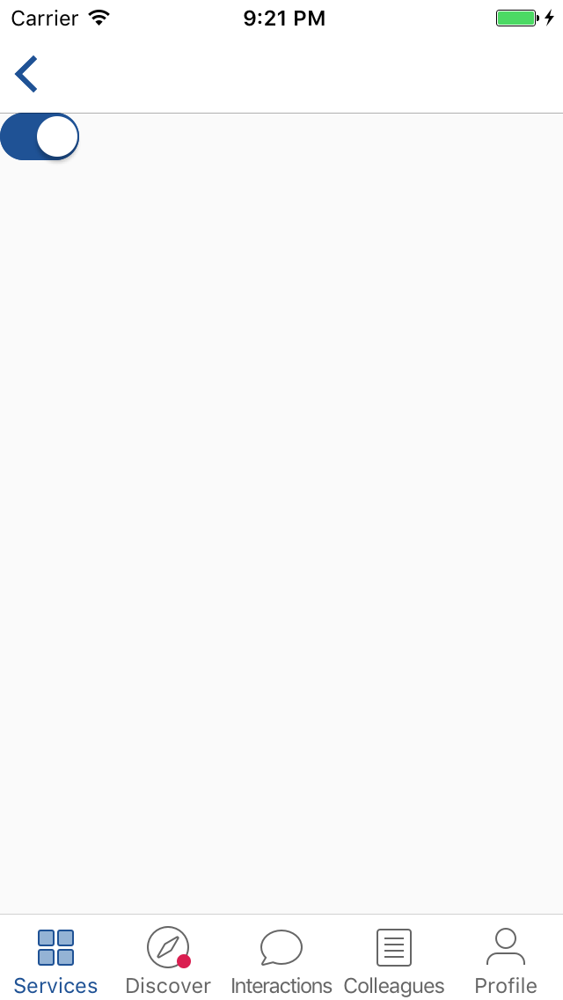</kbd>
  <kbd>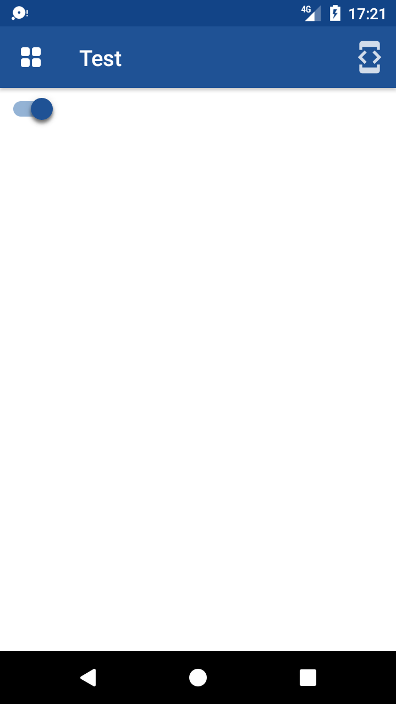</kbd>
  </p>
  <br/>

## TextArea

### disable

This function disables the textarea.

### enable

This function enables the textarea.

### getMaxLength

This function returns the textarea's maximum length.

### getPlaceholder

This function returns the textarea's placeholder' value.

### getValue

This function returns the textarea's value.

### onClick

This function sets the function that will be called once a click is performed on the textarea.

**Parameters**
     
- `fn` **[function](https://developer.mozilla.org/en-US/docs/Web/JavaScript/Reference/Functions)** the function to call

### onInput

This function sets the function that will be called every time there is a change in the textarea.

**Parameters**
     
- `fn` **[function](https://developer.mozilla.org/en-US/docs/Web/JavaScript/Reference/Functions)** the function to call

### setAssistiveText

This function sets the value of the textarea's assistive text (Android-only, will do nothing on iOS).

- `value` **[string](https://developer.mozilla.org/en-US/docs/Web/JavaScript/Reference/Global_Objects/String)** the value of the assistive text

### setHeader

This function adds a header to the textarea, the same header-like as the list can have (iOS-only). For Android, it will also work as the setPlaceholder method.

- `text` **[string](https://developer.mozilla.org/en-US/docs/Web/JavaScript/Reference/Global_Objects/String)** the value of the header

### setMaxLength

This function sets the textarea's maximum length.

- `maxLength` **[number](https://developer.mozilla.org/en-US/docs/Web/JavaScript/Reference/Global_Objects/Number)** the maximum length of the textarea

### setRequired

This function makes the textarea required or not (this will add an assistive-text on Android Textareas and only an asterisk on iOS Textareas).

- `required` **[boolean](https://developer.mozilla.org/en-US/docs/Web/JavaScript/Reference/Global_Objects/Boolean)** the boolean to set the requirement of the textarea

### setPlaceholder

This function sets the value of the textarea's placeholder.

- `value` **[string](https://developer.mozilla.org/en-US/docs/Web/JavaScript/Reference/Global_Objects/String)** the value of the placeholder

### setType

This function sets the type of the textarea.

- `type` **[string](https://developer.mozilla.org/en-US/docs/Web/JavaScript/Reference/Global_Objects/String)** the type of the textarea

### setValue

This function sets the value of the textarea.

- `value` **[string](https://developer.mozilla.org/en-US/docs/Web/JavaScript/Reference/Global_Objects/String)** the value of the textarea

**Example**

```javascript
document.body.appendChild(
    Workwell.ui.createTextArea()
        .setPlaceholder("I'm a placeholder")
        .setMaxLength(48)
        .setAssistiveText("<span style='color:red'>I'm a textarea</span>")
        .onInput(function(){
            console.log("textarea's value has changed");
        })
        .toHTMLElement()
);
```

<br/>
  <p align="center">
  <kbd></kbd>
  <kbd>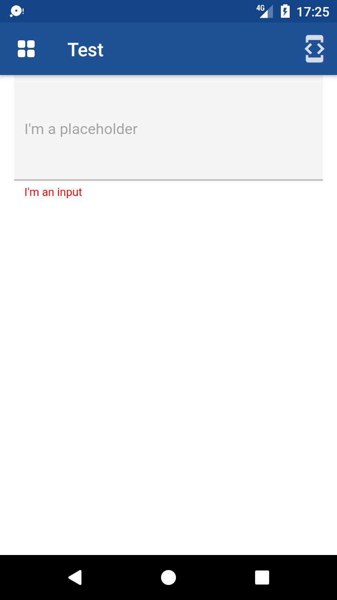</kbd>
  </p>
  <br/>
