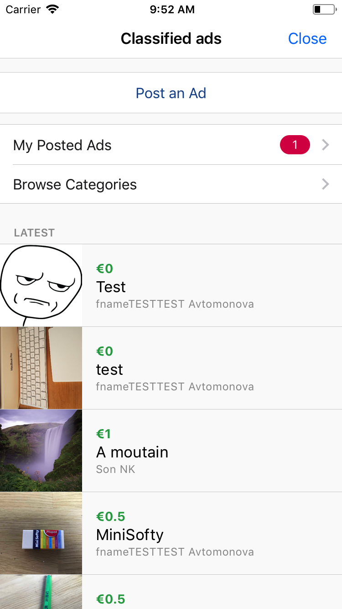
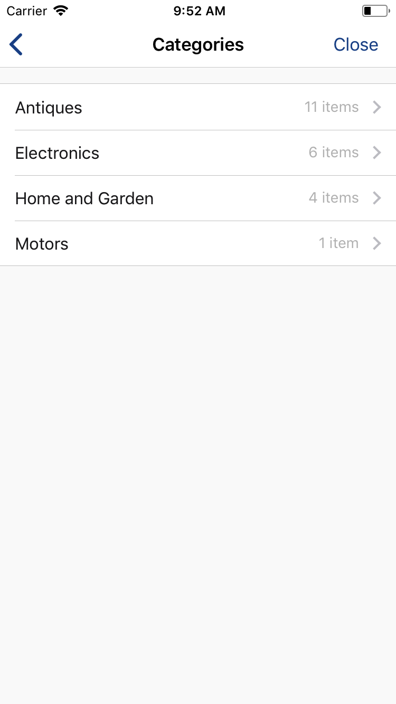
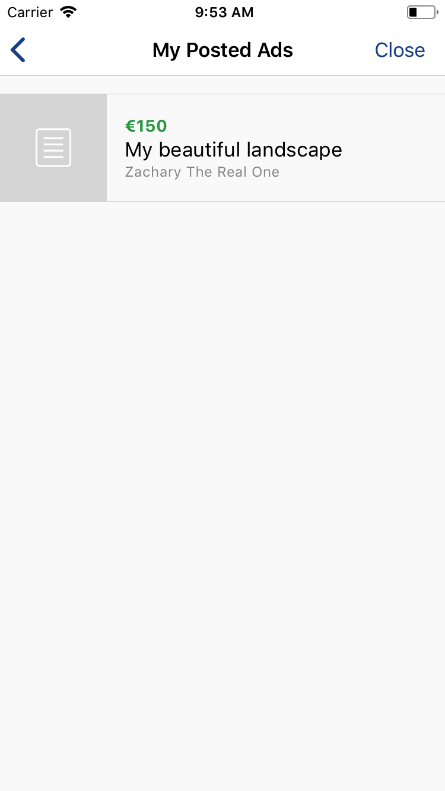
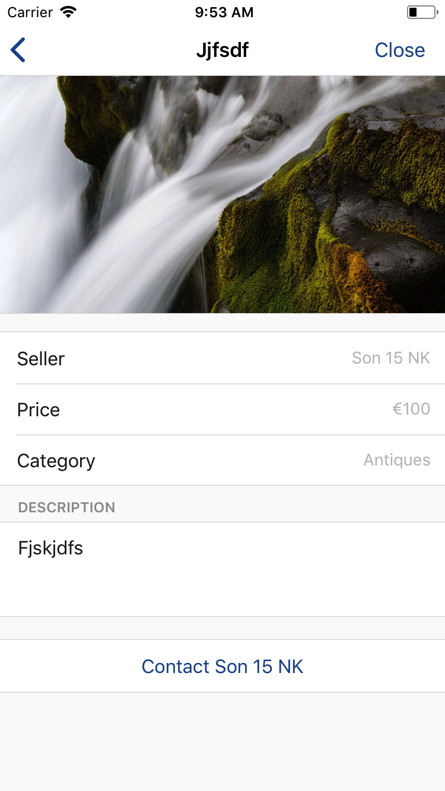
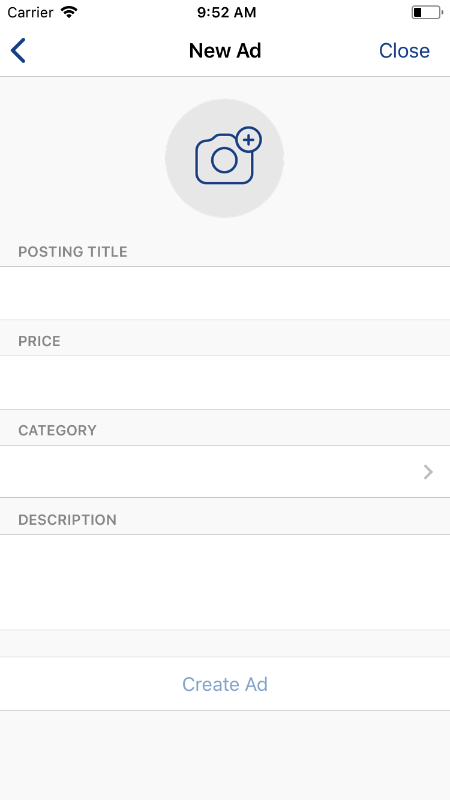
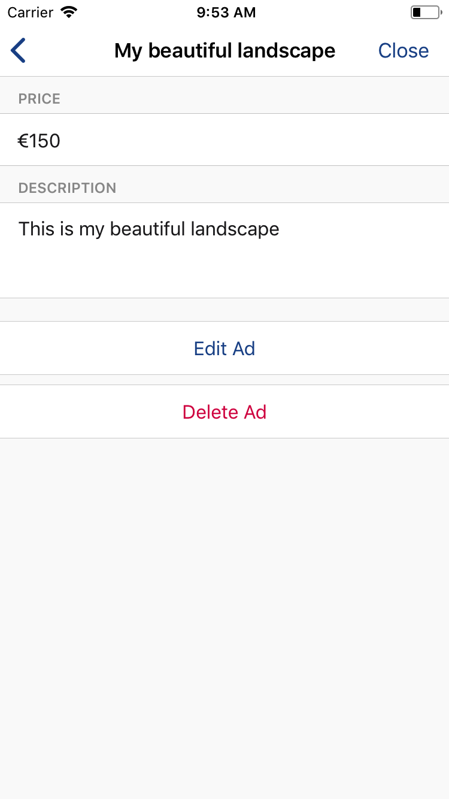
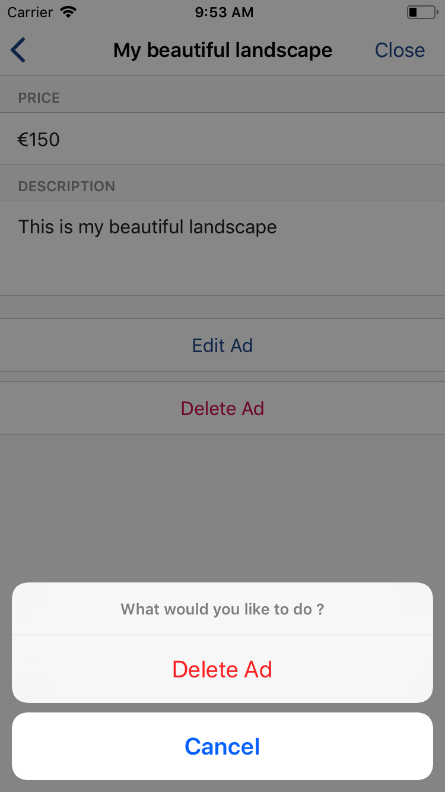

To maximize impact and reach, keep the following principles in mind as you imagine your service’s identity.

## Color Palette ##

We recommend that you try using colors from this color palette (or in the same tones) for your service to look like an actual part of the Workwell application.

 

  

    

    

    
#1f5295

    
rgb(31, 82, 149)

  

  

    

    

    
#94b3d5

    
rgb(148, 179, 213)

  

  

    

    

    
#d2d2d2

    
rgb(210, 210, 210)
  
  

  

    

    

    
#da1e50

    
rgb(218, 30, 80)

  

  

    

    

    
#fdcf2e

    
rgb(253, 207, 46)

  

  

    

    

    
#fafafa

    
rgb(250, 250, 250)

  

 
 

## Example ##

Here is an example of one of our own services UI (Using Workwell. CSS / UI / openWebPage) :

Home Page :

Browse Categories :

My Posted Ads :

 

Item Details :

Post An Ad :

My Item Details :

 

Delete My Item :

