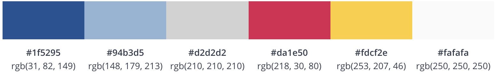

# UI Guidelines

To maximize impact and reach, keep the following principles in mind as you imagine your service’s identity.

## Color Palette ##

We recommend that you try using colors from this color palette (or in the same tones) for your service to look like an actual part of the Workwell application.

 

## Example ##

Here is an example of one of our own services UI (Using Workwell. CSS / UI / openWebPage) :

| Home Page     | Browse Categories | My Posted Ads |
|---------------|-------------------|---------------|
|   |      |         |

| Item Details  | Post An Ad        | My Item Details |
|---------------|-------------------|-----------------|
|   |      |         |

| Item Details  |
|---------------|
|   |
